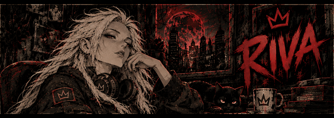

  

<h1 align="center">Рива / Riva</h1>

Музыка для твоей компании. Дзени, слоты, достижения и раздачи игр для твоего сервера.

  <a href="https://discord.com/oauth2/authorize?client_id=1553060783603195985&amp;scope=bot+applications.commands&amp;permissions=3197952&amp;integration_type=0"><strong>Добавить на сервер ↗</strong></a>
  &nbsp; · &nbsp;
  <a href="https://dionisgxd.github.io/Riva-Bot-docs/">Открыть сайт</a>
  &nbsp; · &nbsp;
  <a href="https://discord.gg/xz8Fv99Xxs">Сервер поддержки</a>
  &nbsp; · &nbsp;
  <a href="mailto:ddyeyeye@gmail.com">Запросы о данных</a>

## Что умеет Рива

- **Музыка:** подключение по `/play` без обязательной `/setup`, поиск по названию, ссылки YouTube и Spotify, очередь, пауза и пропуск треков. По Spotify-ссылке подбирается версия на YouTube, совпадение не гарантируется.
- **DJ и очередь:** роль DJ, голосование за пропуск чужого трека и удаление ожидающих треков с возвратом стоимости.
- **Дзени:** ежедневная награда, баланс и рейтинг участников. Администратор настраивает награду, цену трека или бесплатную музыку.
- **Слоты:** ставки от 1 до 1000 дзени, комбинации и шуточные призы.
- **Профиль:** личная статистика и достижения.
- **Раздачи игр:** уведомления Riva Gaming о бесплатных играх Steam, Epic Games Store и GOG. Бесплатные выходные включены по умолчанию и отключаются в настройках; DLC и внутриигровые предметы исключены.
- **Голосовые фразы:** ручной запуск, если администратор разрешил эту функцию; автоматические случайные фразы — только при постоянном подключении.

На каждом Discord-сервере свои балансы, достижения, настройки и музыкальная очередь. Ответы команд оформлены в едином стиле Ривы: карточки с понятными разделами, подсказками и сообщениями об ошибках.

## Начать за три шага

1. **Добавь Риву** по ссылке выше на сервер, которым можешь управлять.
2. **Зайди в голосовой канал:** выбери обычную голосовую комнату и получи дзени через `/daily`. Риве нужны права просматривать канал, подключаться и говорить.
3. **Запусти трек:** вызови `/play` с названием песни или ссылкой — Рива подключится сама. Текущую цену покажет `/balance`, первые шаги — `/start`, подсказки и владельца — `/help`.

Самому боту право **Administrator** не требуется. На новом сервере голосовые фразы выключены: администратор разрешает их через `/setup`, а случайные запуски включает отдельно через `/random`.

## Голосовая комната — на время музыки или постоянно

На новом сервере предварительная `/setup` не нужна. В обычном режиме Рива выходит, когда закончились музыка, очередь и незавершённые запросы; на паузе соединение сохраняется. Пока Рива обслуживает одну комнату Discord-сервера, запрос из другой её не перемещает.

Постоянное подключение включается администратором через `/setup stay:true channel:комната` или `/home channel:комната`. Отключить его можно через `/setup stay:false`: текущая очередь доигрывает, затем бот выходит; если Рива уже простаивает, она выходит сразу. Серверы с ранее настроенной постоянной комнатой сохраняют этот режим до явного отключения.

`/stop` отменяет незавершённые поиски и очищает очередь. В обычном режиме Рива выходит из комнаты, в постоянном остаётся. Автоматические случайные фразы доступны только в постоянном режиме.

## Команды

| Команда | Что делает |
| --- | --- |
| `/start` | Краткая инструкция по настройке и первым командам |
| `/privacy` | Обработка данных и политика конфиденциальности |
| `/delete_my_data` | Удаление своего профиля на текущем сервере с подтверждением |
| `/help` | Показывает подсказки, владельца и ссылку на сервер поддержки |
| `/setup` | Настраивает необязательную постоянную комнату, уведомления и разрешение фраз; параметр stay включает или отключает постоянное подключение |
| `/home` | Выбирает голосовую комнату и включает постоянное подключение |
| `/status` | Показывает состояние и настройки бота |
| `/play` | Добавляет трек по цене сервера; по умолчанию 10 дзени |
| `/queue` | Показывает текущий трек и очередь |
| `/pause`, `/resume` | Приостанавливает и продолжает воспроизведение |
| `/skip` | Пропускает свой трек; для чужого запускает голосование, если ты не DJ |
| `/stop` | Отменяет поиски, останавливает музыку и очищает очередь; в обычном режиме выходит. Только DJ или администратор |
| `/remove` | Удаляет свой ожидающий трек с возвратом стоимости; DJ может удалить любой |
| `/dj set`, `/dj clear`, `/dj status` | Назначает роль DJ, снимает её или показывает правила управления |
| `/economy settings`, `/economy status` | Настраивает или показывает ежедневную награду, цену трека и бесплатную музыку |
| `/daily`, `/balance` | Выдаёт ежедневную награду и показывает баланс |
| `/slots`, `/slotsrules` | Запускает слоты со ставкой и объясняет правила |
| `/profile`, `/achievements` | Показывает статистику и достижения |
| `/top` | Показывает рейтинг по балансу на текущем сервере |
| `/giveaways setup` | Создаёт вебхук Riva Gaming для раздач в выбранном текстовом канале |
| `/giveaways settings`, `/giveaways status` | Фильтры магазинов, бесплатные выходные и состояние доставки |
| `/giveaways disable`, `/giveaways resume` | Отключает и возобновляет рассылку раздач |
| `/phrase` | Воспроизводит разрешённую голосовую фразу |
| `/random` | Настраивает случайные фразы для постоянного подключения; доступна администратору сервера |

## Дзени и музыка

Начальный баланс — ноль. **По умолчанию** `/daily` выдаёт **100 дзени раз в 24 часа**, добавление трека стоит **10 дзени**. Администратор может изменить награду и цену через `/economy settings` или включить бесплатную музыку. Текущие условия видны в `/balance`.

Если трек не запустился из-за ошибки, списанная стоимость возвращается. `/remove` также возвращает стоимость удалённого ожидающего трека тому, кто его добавил. Ручной пропуск и остановка, а также ошибка после начала воспроизведения не дают возврата. Если ссылка отклонена до добавления в очередь, плата не списывается.

При очистке через `/stop` стоимость ожидающих треков также не возвращается. Повторная загрузка при отказе источника с кодом 403 до начала музыки не создаёт повторного списания.

Дзени — только игровая валюта: их нельзя купить за реальные деньги, вывести или обменять на материальные призы. Бесплатных спинов нет; выигрыш не гарантируется.

## Управление музыкой

Музыкальные команды требуют присутствия в голосовой комнате Ривы. Свой трек можно поставить на паузу, продолжить или пропустить. Для чужого трека `/skip` запускает голосование большинства слушателей с включённым звуком. DJ и участники с правом «Управлять сервером» управляют всей очередью. Роль назначается через `/dj set`.

Лимиты: **до 5 ожидающих треков от одного участника**, **до 15 минут на трек**, **до 50 треков в очереди**.

Очередь поиска отдельная: если поиск занят, запрос может ждать до двух минут без списания дзени. Выход заказчика из комнаты отменяет его незавершённый поиск, `/stop` — незавершённые запросы текущего сервера. При переполнении или истечении ожидания запрос отклоняется без оплаты. Число одновременных поисков и аудиопотоков ограничено ресурсами бота.

Если YouTube требует подтверждения возраста, Рива показывает понятное уведомление. Бот не использует аккаунт YouTube и не воспроизводит такие видео — выбери другую доступную версию трека. Рива передаёт в голосовой канал только звук.

## Раздачи игр — Riva Gaming

Администратор запускает `/giveaways setup` и выбирает текстовый канал. Рива сама создаёт вебхук: передавать его ссылку владельцу бота не нужно. В выбранном канале боту нужны права **«Просматривать канал»** и **«Управлять вебхуками»**.

Источник предложений — **GamerPower**. Поддерживаются Steam, Epic Games Store и GOG: раздачи полных игр и бесплатные выходные. Бесплатные выходные включены по умолчанию и отключаются через `/giveaways settings`; они дают временный доступ, а не игру навсегда. DLC и внутриигровые предметы исключены.

При включении приходит первая подборка, затем — новые предложения. Проверка выполняется примерно раз в 30 минут; сроки, регионы и наличие ключей зависят от магазина и организатора раздачи. Фильтры меняются через `/giveaways settings`, состояние и ошибки доставки доступны в `/giveaways status`.

## Личные данные

`/privacy` объясняет обработку данных и даёт ссылку на политику. `/delete_my_data` удаляет твой профиль **на текущем сервере** после подтверждения. Подробности о резервных копиях и сроках хранения — в [политике конфиденциальности](PRIVACY.md).

Ручные и скачанные резервные копии, а также старые сообщения Discord не очищаются командой автоматически. Для их обработки или удаления данных на всех серверах обратись к владельцу по email. Отключение постоянного голосового подключения само по себе не удаляет профиль и баланс.

## Ранний доступ

Возможны перерывы и ограничения одновременного воспроизведения. Доступность музыки зависит от Discord и внешних сервисов. Слоты и голосовые фразы могут содержать ненормативную лексику.

## Документы и связь

- [Условия использования](TERMS.md)
- [Политика конфиденциальности](PRIVACY.md)
- Владелец и разработчик: **[Discord ID 673817593668173836](https://discord.com/users/673817593668173836)**. Этот же аккаунт указан в `/help`.
- Поддержка, сообщения об ошибках и запросы на удаление данных: **[ddyeyeye@gmail.com](mailto:ddyeyeye@gmail.com)**.
- Сервер поддержки Ривы: **[discord.gg/xz8Fv99Xxs](https://discord.gg/xz8Fv99Xxs)**.

Для вопроса о балансе или удаления данных укажи Discord-ID пользователя и сервера. Не отправляй пароли и токены. Если пишешь в публичный Issue, не прикладывай конфиденциальные данные.

## Об этом репозитории

Здесь размещены публичный сайт Ривы, изображения и документы. Исходный код работающего бота и пользовательские балансы в этот репозиторий не входят.

| Файлы | Назначение |
| --- | --- |
| `index.html`, `style.css` | Страница сайта и оформление |
| `avatar.png`, `banner.png` | Аватар и баннер Ривы |
| `zenny.png`, `tune.png`, `spin.png`, `nexus.png`, `jackpot.png`, `bruh.png` | Эмодзи проекта |
| `TERMS.md`, `PRIVACY.md` | Условия и политика конфиденциальности |

Сайт публикуется через GitHub Pages из ветки `main`, папки `/(root)`.

Рива — независимый проект, не представляющий Discord, YouTube или Spotify.
